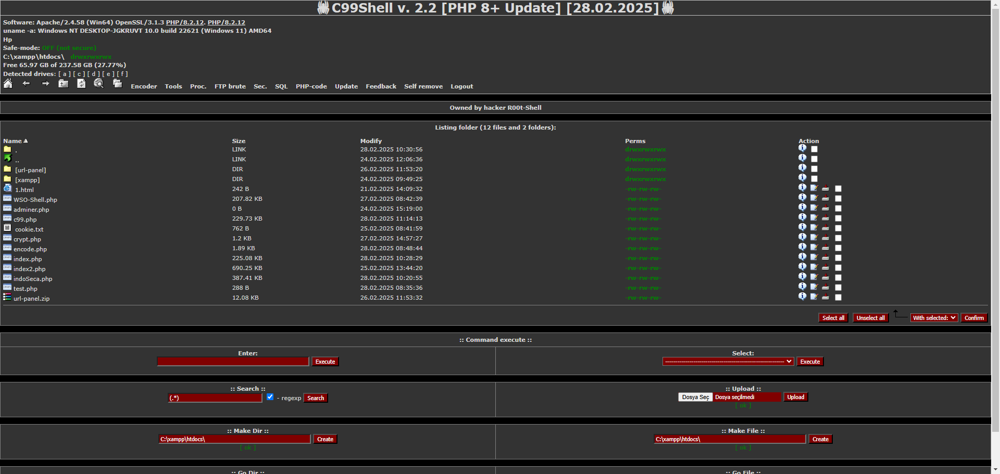

# c99 shell php 8+
C99 PHP Web Shell for ethical hacking and penetration testing — file manager, command execution, and server control in one script.



## 🖥️ Technical Specifications

| Feature               | Description                                                             |
|-----------------------|-------------------------------------------------------------------------|
| **Version**           | 2.4 – Updated for full compatibility with PHP 8+                        |
| **Compatibility**     | Supports PHP 5.x, 7.x, and 8.x                                          |
| **File Size**         | Approximately 150 KB (lightweight and fast-loading)                     |

## 🔧 Installation

To install **C99 Shell** on your server, follow these steps:

1. **Download the Shell Script**  
   Use `wget` or `curl` to download the `c99.php` file:

   
   **Using curl**
   ```bash
   curl -o c99.php https://raw.githubusercontent.com/yourusername/C99/main/c99.php
   ```

   **Using wget**
   ```bash
   wget https://raw.githubusercontent.com/yourusername/C99/main/c99.php -O c99.php
   ```
3. **Upload to Your Server**
Transfer the c99.php file to your web server using FTP, SCP, or your hosting control panel’s file manager.
Access the Shell
Open a web browser and navigate to the script’s URL:
   ```bash
   https://your-domain.com/c99.php
   ```


## 🚀 Key Features

- **Advanced File Management**  
  Browse directories, create and delete files or folders, upload and edit content—all through a clean web interface.

- **Remote Command Execution**  
  Execute system-level commands in real time directly from your browser, with support for multiple PHP execution methods.

- **MySQL Database Control**  
  Connect to MySQL databases, run SQL queries, view tables, and manage records without needing phpMyAdmin.

- **System Environment Overview**  
  Inspect detailed information about the server: OS, PHP version, server software, memory usage, and more.

- **Security & Configuration Access**  
  Identify server vulnerabilities, read sensitive configuration files, and evaluate security posture.

- **Data Encryption & Hashing Tools**  
  Encrypt or hash data using built-in tools (Base64, MD5, SHA1, SHA256, etc.) for quick testing and encoding.

- **Custom PHP Code Execution**  
  Run your own PHP scripts directly in the shell to test code, perform audits, or build custom tools.

- **Server-Wide File Search**  
  Search by file name or content across directories to quickly locate sensitive data or hidden files.

- **FTP Brute Force Scanner**  
  Test FTP credentials against a target server to assess the strength of login protection (for ethical testing only).

